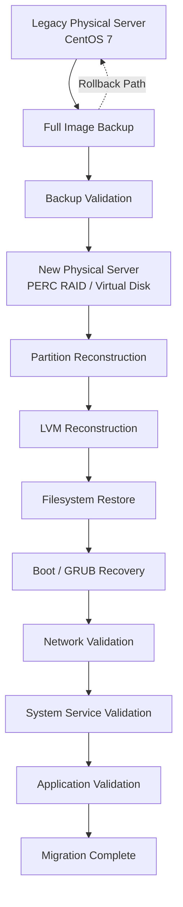

# CentOS 7 Legacy Server Migration Case Study

### [CentOS 7 Legacy Server Migration](https://github.com/wenan1130/centos7-server-migration-case-study)

Physical CentOS 7 server migration to new hardware,
including backup, storage reconstruction, LVM restoration,
boot recovery, and post-migration validation.

**Key areas:** CentOS 7 · LVM · Backup & Recovery · Physical Server Migration · Boot Recovery · Validation

## Overview

This case study documents the migration of a legacy CentOS 7 physical server to new server hardware while preserving the existing operating system and application environment.

The migration focused on minimizing operational risk, maintaining rollback capability, and validating the restored system before production use.

---

## Business Problem

The original physical server was running CentOS 7 and an existing application environment that could not be safely rebuilt from scratch.

The server hardware needed to be replaced while preserving:

- Existing operating system
- Application environment
- Filesystem structure
- LVM configuration
- System services
- Network configuration
- Operational data

A full system migration was therefore selected instead of a clean OS reinstall.

---

## Source Environment

- CentOS 7
- Physical Linux server
- Legacy application environment
- Separate `/boot` partition
- LVM-based storage
- Production data and services

---

## Target Environment

- New physical server
- Hardware RAID / virtual disk
- Larger storage capacity
- Reconstructed partition layout
- Reconstructed LVM environment
- Restored CentOS 7 operating system and application stack

---

## Key Challenges

The main technical challenges included:

- Migrating a legacy Linux environment without rebuilding the application stack
- Preserving the existing CentOS 7 installation
- Restoring the system onto different physical hardware
- Reconstructing partition and LVM layouts
- Handling different source and target disk capacities
- Preserving bootability
- Maintaining rollback capability
- Validating application and service functionality after migration

---
## Migration Architecture



---

## Migration Strategy

```text
Legacy CentOS 7 Server
        │
        ▼
System Assessment
        │
        ▼
Full Image Backup
        │
        ▼
New Server Storage Preparation
        │
        ▼
Partition / LVM Reconstruction
        │
        ▼
Filesystem Restore
        │
        ▼
Boot Recovery
        │
        ▼
Network / Service Validation
        │
        ▼
Application Validation
        │
        ▼
Migration Complete
```
---

## Validation Checklist

- [x] System boots successfully
- [x] Root filesystem available
- [x] LVM volumes detected
- [x] Filesystems mounted correctly
- [x] Network configuration validated
- [x] Required system services validated
- [x] Application environment preserved
- [x] Original backup retained for rollback

For the full reusable validation procedure, see [Server Migration Validation Checklist](docs/validation-checklist.md).

## Result

Legacy CentOS 7 environment successfully
migrated to new server hardware.

## Lessons Learned
